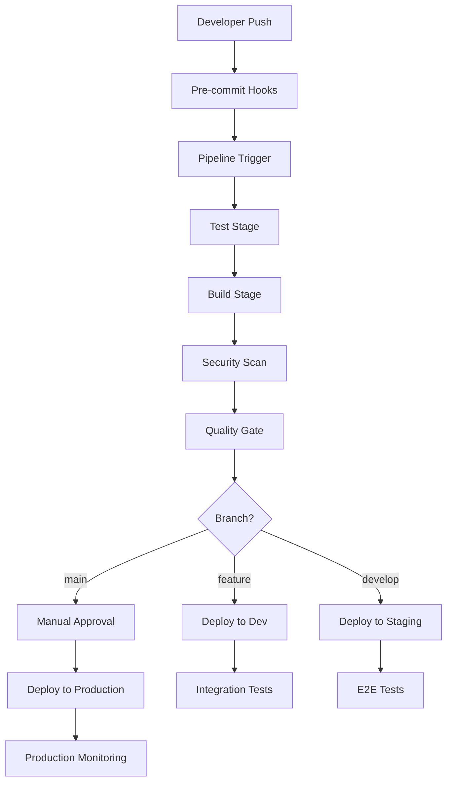

# CI/CD Blueprint: VagrantGazelle
**Comprehensive Continuous Integration & Deployment Strategy**  
**Version:** 2.0  
**Focus:** Production-Ready Pipeline with Security & Quality Gates

## Table of Contents
1. [Pipeline Architecture](#pipeline-architecture)
2. [Quality Gates](#quality-gates)
3. [Security Integration](#security-integration)
4. [Multi-Environment Strategy](#multi-environment-strategy)
5. [Monitoring & Observability](#monitoring--observability)
6. [Rollback Strategies](#rollback-strategies)

---

## 1. Pipeline Architecture

### Overview



### Multi-Platform Pipeline Support

#### GitHub Actions Workflow

```yaml
# .github/workflows/ci-cd.yml
name: Gazelle CI/CD Pipeline

on:
  push:
    branches: [ main, develop ]
  pull_request:
    branches: [ main ]
  workflow_dispatch:
    inputs:
      environment:
        description: 'Target environment'
        required: true
        default: 'staging'
        type: choice
        options:
        - staging
        - production

env:
  REGISTRY: ghcr.io
  IMAGE_NAME: ${{ github.repository }}

jobs:
  # Pre-commit validation
  pre-commit:
    runs-on: ubuntu-latest
    steps:
    - uses: actions/checkout@v4
    - uses: pre-commit/action@v3.0.0
      with:
        extra_args: --all-files

  # Code quality and testing
  test-and-quality:
    runs-on: ubuntu-latest
    needs: pre-commit
    services:
      mysql:
        image: mysql:8.0
        env:
          MYSQL_ROOT_PASSWORD: test_password
          MYSQL_DATABASE: gazelle_test
        options: >-
          --health-cmd="mysqladmin ping"
          --health-interval=10s
          --health-timeout=5s
          --health-retries=3
        ports:
        - 3306:3306

      redis:
        image: redis:7-alpine
        options: >-
          --health-cmd "redis-cli ping"
          --health-interval 10s
          --health-timeout 5s
          --health-retries 5
        ports:
        - 6379:6379

    steps:
    - name: Checkout code
      uses: actions/checkout@v4

    - name: Setup PHP
      uses: shivammathur/setup-php@v2
      with:
        php-version: '8.2'
        extensions: mbstring, xml, ctype, iconv, intl, pdo, pdo_mysql, dom, filter, gd, json, redis
        coverage: xdebug

    - name: Cache Composer packages
      id: composer-cache
      uses: actions/cache@v3
      with:
        path: vendor
        key: ${{ runner.os }}-php-${{ hashFiles('**/composer.lock') }}
        restore-keys: |
          ${{ runner.os }}-php-

    - name: Install dependencies
      run: composer install --prefer-dist --no-progress

    - name: Run PHPStan
      run: vendor/bin/phpstan analyse src --level=7

    - name: Run PHPCS
      run: vendor/bin/phpcs src --standard=PSR12

    - name: Run PHPMD
      run: vendor/bin/phpmd src text cleancode,codesize,controversial,design,naming,unusedcode

    - name: Run PHPUnit Tests
      run: |
        vendor/bin/phpunit --coverage-clover=coverage.xml
        
    - name: Upload coverage to Codecov
      uses: codecov/codecov-action@v3
      with:
        token: ${{ secrets.CODECOV_TOKEN }}
        files: ./coverage.xml

    - name: Run Psalm
      run: vendor/bin/psalm --show-info=true

  # Frontend testing (if applicable)
  frontend-test:
    runs-on: ubuntu-latest
    needs: pre-commit
    steps:
    - uses: actions/checkout@v4
    - uses: actions/setup-node@v4
      with:
        node-version: '18'
        cache: 'npm'
    - run: npm ci
    - run: npm run test
    - run: npm run build

  # Security scanning
  security-scan:
    runs-on: ubuntu-latest
    needs: test-and-quality
    steps:
    - name: Checkout code
      uses: actions/checkout@v4

    - name: Run Semgrep
      uses: returntocorp/semgrep-action@v1
      with:
        config: >-
          p/security-audit
          p/secrets
          p/php

    - name: Run Snyk to check for vulnerabilities
      uses: snyk/actions/php@master
      env:
        SNYK_TOKEN: ${{ secrets.SNYK_TOKEN }}

    - name: Run Trivy vulnerability scanner
      uses: aquasecurity/trivy-action@master
      with:
        scan-type: 'fs'
        scan-ref: '.'
        format: 'sarif'
        output: 'trivy-results.sarif'

    - name: Upload Trivy scan results to GitHub Security tab
      uses: github/codeql-action/upload-sarif@v2
      if: always()
      with:
        sarif_file: 'trivy-results.sarif'

  # Build and push Docker image
  build-and-push:
    runs-on: ubuntu-latest
    needs: [test-and-quality, security-scan]
    permissions:
      contents: read
      packages: write

    steps:
    - name: Checkout repository
      uses: actions/checkout@v4

    - name: Set up Docker Buildx
      uses: docker/setup-buildx-action@v3

    - name: Log in to Container Registry
      uses: docker/login-action@v3
      with:
        registry: ${{ env.REGISTRY }}
        username: ${{ github.actor }}
        password: ${{ secrets.GITHUB_TOKEN }}

    - name: Extract metadata
      id: meta
      uses: docker/metadata-action@v5
      with:
        images: ${{ env.REGISTRY }}/${{ env.IMAGE_NAME }}
        tags: |
          type=ref,event=branch
          type=ref,event=pr
          type=sha,prefix={{branch}}-
          type=raw,value=latest,enable={{is_default_branch}}

    - name: Build and push Docker image
      uses: docker/build-push-action@v5
      with:
        context: .
        target: production
        push: true
        tags: ${{ steps.meta.outputs.tags }}
        labels: ${{ steps.meta.outputs.labels }}
        cache-from: type=gha
        cache-to: type=gha,mode=max

    - name: Run Trivy vulnerability scanner on image
      uses: aquasecurity/trivy-action@master
      with:
        image-ref: ${{ env.REGISTRY }}/${{ env.IMAGE_NAME }}:${{ github.sha }}
        format: 'sarif'
        output: 'trivy-image-results.sarif'

  # Deploy to staging
  deploy-staging:
    runs-on: ubuntu-latest
    needs: build-and-push
    if: github.ref == 'refs/heads/develop'
    environment:
      name: staging
      url: https://staging.gazelle.yourdomain.com

    steps:
    - name: Checkout code
      uses: actions/checkout@v4

    - name: Configure AWS credentials
      uses: aws-actions/configure-aws-credentials@v2
      with:
        aws-access-key-id: ${{ secrets.AWS_ACCESS_KEY_ID }}
        aws-secret-access-key: ${{ secrets.AWS_SECRET_ACCESS_KEY }}
        aws-region: us-west-2

    - name: Set up Terraform
      uses: hashicorp/setup-terraform@v2

    - name: Deploy infrastructure
      run: |
        cd infrastructure/environments/staging
        terraform init
        terraform plan -out=tfplan
        terraform apply -auto-approve tfplan

    - name: Deploy to EKS
      run: |
        aws eks update-kubeconfig --region us-west-2 --name staging-gazelle-cluster
        kubectl set image deployment/gazelle-app gazelle-app=${{ env.REGISTRY }}/${{ env.IMAGE_NAME }}:${{ github.sha }} -n gazelle-staging
        kubectl rollout status deployment/gazelle-app -n gazelle-staging

    - name: Run health checks
      run: |
        sleep 30
        curl -f https://staging.gazelle.yourdomain.com/health || exit 1

  # Deploy to production
  deploy-production:
    runs-on: ubuntu-latest
    needs: build-and-push
    if: github.ref == 'refs/heads/main'
    environment:
      name: production
      url: https://gazelle.yourdomain.com

    steps:
    - name: Checkout code
      uses: actions/checkout@v4

    - name: Configure AWS credentials
      uses: aws-actions/configure-aws-credentials@v2
      with:
        aws-access-key-id: ${{ secrets.AWS_ACCESS_KEY_ID }}
        aws-secret-access-key: ${{ secrets.AWS_SECRET_ACCESS_KEY }}
        aws-region: us-west-2

    - name: Deploy infrastructure
      run: |
        cd infrastructure/environments/production
        terraform init
        terraform plan -out=tfplan
        terraform apply -auto-approve tfplan

    - name: Deploy to EKS with Blue-Green
      run: |
        aws eks update-kubeconfig --region us-west-2 --name production-gazelle-cluster
        
        # Create green deployment
        kubectl patch deployment gazelle-app -p '{"spec":{"template":{"spec":{"containers":[{"name":"gazelle-app","image":"'${{ env.REGISTRY }}/${{ env.IMAGE_NAME }}:${{ github.sha }}'"}]}}}}' -n gazelle-production
        
        # Wait for green deployment
        kubectl rollout status deployment/gazelle-app -n gazelle-production
        
        # Health check
        sleep 60
        curl -f https://gazelle.yourdomain.com/health || exit 1

    - name: Notify deployment success
      uses: 8398a7/action-slack@v3
      with:
        status: success
        text: 'Production deployment successful! 🚀'
      env:
        SLACK_WEBHOOK_URL: ${{ secrets.SLACK_WEBHOOK_URL }}
```

#### Jenkins Declarative Pipeline

```groovy
// Jenkinsfile
pipeline {
    agent any
    
    environment {
        DOCKER_REGISTRY = 'your-registry.com'
        IMAGE_NAME = 'gazelle'
        KUBECONFIG = credentials('kubeconfig')
        SONAR_TOKEN = credentials('sonar-token')
    }
    
    stages {
        stage('Checkout') {
            steps {
                checkout scm
                script {
                    env.GIT_COMMIT_SHORT = sh(
                        script: "git rev-parse --short HEAD",
                        returnStdout: true
                    ).trim()
                }
            }
        }
        
        stage('Pre-build Validation') {
            parallel {
                stage('Code Quality') {
                    steps {
                        sh 'composer install'
                        sh 'vendor/bin/phpcs src --standard=PSR12'
                        sh 'vendor/bin/phpmd src text cleancode,codesize,controversial,design,naming,unusedcode'
                        sh 'vendor/bin/phpstan analyse src --level=7'
                    }
                }
                
                stage('Unit Tests') {
                    steps {
                        sh 'vendor/bin/phpunit --coverage-clover=coverage.xml'
                        publishHTML([
                            allowMissing: false,
                            alwaysLinkToLastBuild: true,
                            keepAll: true,
                            reportDir: 'coverage',
                            reportFiles: 'index.html',
                            reportName: 'Coverage Report'
                        ])
                    }
                }
                
                stage('Security Scan') {
                    steps {
                        sh 'composer audit'
                        sh 'semgrep --config=p/security-audit --config=p/secrets src/'
                    }
                }
            }
        }
        
        stage('SonarQube Analysis') {
            steps {
                withSonarQubeEnv('SonarQube') {
                    sh """
                        sonar-scanner \
                            -Dsonar.projectKey=gazelle \
                            -Dsonar.sources=src \
                            -Dsonar.php.coverage.reportPaths=coverage.xml
                    """
                }
            }
        }
        
        stage('Quality Gate') {
            steps {
                timeout(time: 5, unit: 'MINUTES') {
                    waitForQualityGate abortPipeline: true
                }
            }
        }
        
        stage('Build Docker Image') {
            steps {
                script {
                    def image = docker.build("${DOCKER_REGISTRY}/${IMAGE_NAME}:${env.GIT_COMMIT_SHORT}")
                    docker.withRegistry("https://${DOCKER_REGISTRY}", 'docker-registry-credentials') {
                        image.push()
                        image.push('latest')
                    }
                }
            }
        }
        
        stage('Container Security Scan') {
            steps {
                sh """
                    trivy image --exit-code 1 --severity HIGH,CRITICAL \
                        ${DOCKER_REGISTRY}/${IMAGE_NAME}:${env.GIT_COMMIT_SHORT}
                """
            }
        }
        
        stage('Deploy to Staging') {
            when {
                branch 'develop'
            }
            steps {
                script {
                    sh """
                        helm upgrade --install gazelle-staging ./helm/gazelle \
                            --set image.tag=${env.GIT_COMMIT_SHORT} \
                            --set environment=staging \
                            --namespace gazelle-staging
                    """
                }
            }
        }
        
        stage('Integration Tests') {
            when {
                branch 'develop'
            }
            steps {
                sh 'npm run test:integration'
            }
        }
        
        stage('Deploy to Production') {
            when {
                branch 'main'
            }
            steps {
                input message: 'Deploy to production?', ok: 'Deploy'
                script {
                    sh """
                        helm upgrade --install gazelle-production ./helm/gazelle \
                            --set image.tag=${env.GIT_COMMIT_SHORT} \
                            --set environment=production \
                            --namespace gazelle-production
                    """
                }
            }
        }
        
        stage('Production Health Check') {
            when {
                branch 'main'
            }
            steps {
                script {
                    sh """
                        sleep 60
                        curl -f https://gazelle.yourdomain.com/health || exit 1
                    """
                }
            }
        }
    }
    
    post {
        always {
            cleanWs()
        }
        success {
            slackSend(
                color: 'good',
                message: "✅ Pipeline succeeded for ${env.BRANCH_NAME} - ${env.GIT_COMMIT_SHORT}"
            )
        }
        failure {
            slackSend(
                color: 'danger',
                message: "❌ Pipeline failed for ${env.BRANCH_NAME} - ${env.GIT_COMMIT_SHORT}"
            )
        }
    }
}
```

---

## 2. Quality Gates

### Pre-commit Hooks Configuration

```yaml
# .pre-commit-config.yaml
repos:
  - repo: https://github.com/pre-commit/pre-commit-hooks
    rev: v4.4.0
    hooks:
      - id: trailing-whitespace
      - id: end-of-file-fixer
      - id: check-yaml
      - id: check-added-large-files
      - id: check-merge-conflict
      - id: check-json

  - repo: https://github.com/psf/black
    rev: 22.10.0
    hooks:
      - id: black
        files: \.py$

  - repo: local
    hooks:
      - id: phpcs
        name: PHP CodeSniffer
        entry: vendor/bin/phpcs
        language: system
        files: \.php$
        args: [--standard=PSR12]
        
      - id: phpstan
        name: PHPStan
        entry: vendor/bin/phpstan
        language: system
        files: \.php$
        args: [analyse, --level=7]
        
      - id: phpmd
        name: PHP Mess Detector
        entry: vendor/bin/phpmd
        language: system
        files: \.php$
        args: [text, cleancode,codesize,controversial,design,naming,unusedcode]
```

### PHPUnit Configuration

```xml
<!-- phpunit.xml -->
<?xml version="1.0" encoding="UTF-8"?>
<phpunit xmlns:xsi="http://www.w3.org/2001/XMLSchema-instance"
         xsi:noNamespaceSchemaLocation="https://schema.phpunit.de/9.5/phpunit.xsd"
         bootstrap="vendor/autoload.php"
         cacheResultFile=".phpunit.result.cache"
         executionOrder="depends,defects"
         forceCoversAnnotation="false"
         beStrictAboutCoversAnnotation="true"
         beStrictAboutOutputDuringTests="true"
         beStrictAboutTodoAnnotatedTests="true"
         failOnRisky="true"
         failOnWarning="true"
         verbose="true">

    <testsuites>
        <testsuite name="Unit">
            <directory suffix="Test.php">tests/Unit</directory>
        </testsuite>
        <testsuite name="Feature">
            <directory suffix="Test.php">tests/Feature</directory>
        </testsuite>
        <testsuite name="Integration">
            <directory suffix="Test.php">tests/Integration</directory>
        </testsuite>
    </testsuites>

    <coverage cacheDirectory=".phpunit.cache/code-coverage"
              processUncoveredFiles="true">
        <include>
            <directory suffix=".php">src</directory>
        </include>
        <exclude>
            <directory>vendor</directory>
        </exclude>
        <report>
            <clover outputFile="coverage.xml"/>
            <html outputDirectory="coverage"/>
        </report>
    </coverage>

    <php>
        <env name="APP_ENV" value="testing"/>
        <env name="DB_HOST" value="127.0.0.1"/>
        <env name="DB_DATABASE" value="gazelle_test"/>
        <env name="DB_USERNAME" value="root"/>
        <env name="DB_PASSWORD" value=""/>
    </php>
</phpunit>
```

### SonarQube Configuration

```properties
# sonar-project.properties
sonar.projectKey=gazelle
sonar.projectName=Gazelle Tracker
sonar.projectVersion=1.0
sonar.sourceEncoding=UTF-8

# Source directories
sonar.sources=src
sonar.tests=tests
sonar.exclusions=vendor/**,node_modules/**

# Coverage
sonar.php.coverage.reportPaths=coverage.xml
sonar.php.tests.reportPath=tests/junit.xml

# Quality gates
sonar.qualitygate.wait=true
```

---

## 3. Security Integration

### SAST (Static Application Security Testing)

```yaml
# .github/workflows/security.yml
name: Security Scanning

on:
  push:
    branches: [ main, develop ]
  pull_request:
    branches: [ main ]
  schedule:
    - cron: '0 2 * * 0' # Weekly scan

jobs:
  sast-scan:
    runs-on: ubuntu-latest
    steps:
    - uses: actions/checkout@v4
    
    - name: Run Semgrep
      uses: returntocorp/semgrep-action@v1
      with:
        config: >-
          p/security-audit
          p/secrets
          p/php
          p/owasp-top-10
        generateSarif: "1"
    
    - name: Upload SARIF file
      uses: github/codeql-action/upload-sarif@v2
      with:
        sarif_file: semgrep.sarif
        
    - name: Run CodeQL Analysis
      uses: github/codeql-action/analyze@v2
      with:
        languages: php

  dependency-check:
    runs-on: ubuntu-latest
    steps:
    - uses: actions/checkout@v4
    
    - name: Setup PHP
      uses: shivammathur/setup-php@v2
      with:
        php-version: '8.2'
        
    - name: Install dependencies
      run: composer install --no-dev --prefer-dist
      
    - name: Run security advisories check
      run: composer audit
      
    - name: Run Snyk security scan
      uses: snyk/actions/php@master
      env:
        SNYK_TOKEN: ${{ secrets.SNYK_TOKEN }}
      with:
        args: --severity-threshold=high
```

### DAST (Dynamic Application Security Testing)

```yaml
# .github/workflows/dast.yml
name: Dynamic Security Testing

on:
  schedule:
    - cron: '0 3 * * 1' # Weekly DAST scan

jobs:
  zap-scan:
    runs-on: ubuntu-latest
    steps:
    - name: Checkout
      uses: actions/checkout@v4
      
    - name: ZAP Scan
      uses: zaproxy/action-full-scan@v0.4.0
      with:
        target: 'https://staging.gazelle.yourdomain.com'
        rules_file_name: '.zap/rules.tsv'
        cmd_options: '-a'
```

---

## 4. Multi-Environment Strategy

### Environment Configuration Matrix

| Environment | Branch | Auto Deploy | Approval | Duration | Purpose |
|-------------|--------|-------------|----------|----------|---------|
| Development | feature/* | ✅ | ❌ | Permanent | Feature development |
| Staging | develop | ✅ | ❌ | 7 days | Integration testing |
| Pre-production | release/* | ✅ | Manual | 3 days | Final validation |
| Production | main | ❌ | Required | Permanent | Live application |

### Helm Chart Templates

```yaml
# helm/gazelle/values.yaml
replicaCount: 3

image:
  repository: your-registry/gazelle
  pullPolicy: IfNotPresent
  tag: "latest"

service:
  type: ClusterIP
  port: 80

ingress:
  enabled: true
  className: "nginx"
  annotations:
    cert-manager.io/cluster-issuer: letsencrypt-prod
    nginx.ingress.kubernetes.io/ssl-redirect: "true"
  hosts:
    - host: gazelle.example.com
      paths:
        - path: /
          pathType: Prefix
  tls:
    - secretName: gazelle-tls
      hosts:
        - gazelle.example.com

resources:
  limits:
    cpu: 500m
    memory: 512Mi
  requests:
    cpu: 250m
    memory: 256Mi

autoscaling:
  enabled: true
  minReplicas: 3
  maxReplicas: 10
  targetCPUUtilizationPercentage: 70

# Environment-specific overrides
environments:
  staging:
    replicaCount: 2
    resources:
      limits:
        cpu: 250m
        memory: 256Mi
      requests:
        cpu: 125m
        memory: 128Mi
        
  production:
    replicaCount: 5
    resources:
      limits:
        cpu: 1000m
        memory: 1Gi
      requests:
        cpu: 500m
        memory: 512Mi
```

---

## 5. Monitoring & Observability Integration

### Prometheus Monitoring

```yaml
# monitoring/prometheus-rules.yaml
apiVersion: monitoring.coreos.com/v1
kind: PrometheusRule
metadata:
  name: gazelle-alerts
  namespace: gazelle
spec:
  groups:
  - name: gazelle.rules
    rules:
    - alert: GazelleHighErrorRate
      expr: rate(nginx_ingress_controller_requests{status=~"5.."}[5m]) > 0.1
      for: 5m
      labels:
        severity: critical
      annotations:
        summary: "High error rate detected"
        description: "Error rate is {{ $value }} errors per second"
        
    - alert: GazelleHighLatency
      expr: histogram_quantile(0.95, rate(nginx_ingress_controller_request_duration_seconds_bucket[5m])) > 2
      for: 5m
      labels:
        severity: warning
      annotations:
        summary: "High latency detected"
        description: "95th percentile latency is {{ $value }} seconds"
        
    - alert: GazellePodCrashLooping
      expr: increase(kube_pod_container_status_restarts_total[1h]) > 5
      for: 5m
      labels:
        severity: critical
      annotations:
        summary: "Pod is crash looping"
        description: "Pod {{ $labels.pod }} has restarted {{ $value }} times in the last hour"
```

### Application Performance Monitoring

```yaml
# apm/apm-server.yaml
apiVersion: v1
kind: ConfigMap
metadata:
  name: apm-server-config
data:
  apm-server.yml: |
    apm-server:
      host: "0.0.0.0:8200"
      rum:
        enabled: true
    
    output.elasticsearch:
      hosts: ["elasticsearch:9200"]
    
    setup.kibana:
      host: "kibana:5601"
```

---

## 6. Rollback Strategies

### Automated Rollback Pipeline

```yaml
# .github/workflows/rollback.yml
name: Emergency Rollback

on:
  workflow_dispatch:
    inputs:
      environment:
        description: 'Environment to rollback'
        required: true
        type: choice
        options:
        - staging
        - production
      version:
        description: 'Version to rollback to (commit SHA or tag)'
        required: true

jobs:
  rollback:
    runs-on: ubuntu-latest
    environment: ${{ github.event.inputs.environment }}
    
    steps:
    - name: Checkout code
      uses: actions/checkout@v4
      
    - name: Configure kubectl
      run: |
        aws eks update-kubeconfig --region us-west-2 --name ${{ github.event.inputs.environment }}-gazelle-cluster
        
    - name: Rollback deployment
      run: |
        kubectl rollout undo deployment/gazelle-app -n gazelle-${{ github.event.inputs.environment }}
        kubectl rollout status deployment/gazelle-app -n gazelle-${{ github.event.inputs.environment }}
        
    - name: Health check
      run: |
        sleep 30
        curl -f https://${{ github.event.inputs.environment == 'production' && '' || 'staging.' }}gazelle.yourdomain.com/health
        
    - name: Notify rollback
      uses: 8398a7/action-slack@v3
      with:
        status: custom
        custom_payload: |
          {
            text: "🔄 Emergency rollback completed for ${{ github.event.inputs.environment }}",
            attachments: [{
              color: 'warning',
              fields: [{
                title: 'Environment',
                value: '${{ github.event.inputs.environment }}',
                short: true
              }, {
                title: 'Rollback Version',
                value: '${{ github.event.inputs.version }}',
                short: true
              }]
            }]
          }
      env:
        SLACK_WEBHOOK_URL: ${{ secrets.SLACK_WEBHOOK_URL }}
```

### Blue-Green Deployment Script

```bash
#!/bin/bash
# scripts/blue-green-deploy.sh

set -e

ENVIRONMENT=${1}
NEW_VERSION=${2}
NAMESPACE="gazelle-${ENVIRONMENT}"

echo "Starting Blue-Green deployment..."

# Deploy green version
echo "Deploying green version ${NEW_VERSION}..."
kubectl patch deployment gazelle-app-green \
  -p '{"spec":{"template":{"spec":{"containers":[{"name":"gazelle-app","image":"gazelle:'${NEW_VERSION}'"}]}}}}' \
  -n ${NAMESPACE}

# Wait for green deployment
kubectl rollout status deployment/gazelle-app-green -n ${NAMESPACE}

# Health check green version
echo "Health checking green version..."
kubectl port-forward service/gazelle-service-green 8081:80 -n ${NAMESPACE} &
PF_PID=$!
sleep 10

if curl -f http://localhost:8081/health; then
  echo "Green version health check passed"
  kill $PF_PID
else
  echo "Green version health check failed"
  kill $PF_PID
  exit 1
fi

# Switch traffic to green
echo "Switching traffic to green..."
kubectl patch service gazelle-service \
  -p '{"spec":{"selector":{"version":"green"}}}' \
  -n ${NAMESPACE}

# Wait and verify
sleep 30
if curl -f https://${ENVIRONMENT}.gazelle.yourdomain.com/health; then
  echo "Traffic switch successful"
  
  # Scale down blue version
  kubectl scale deployment gazelle-app-blue --replicas=0 -n ${NAMESPACE}
  echo "Blue-Green deployment completed successfully"
else
  echo "Traffic switch failed, rolling back..."
  kubectl patch service gazelle-service \
    -p '{"spec":{"selector":{"version":"blue"}}}' \
    -n ${NAMESPACE}
  exit 1
fi
```

---

## 7. Integration Testing Framework

### End-to-End Testing

```javascript
// tests/e2e/cypress/integration/gazelle.spec.js
describe('Gazelle Application', () => {
  beforeEach(() => {
    cy.visit('/')
  })

  it('should load homepage', () => {
    cy.contains('Gazelle')
    cy.get('[data-testid="login-form"]').should('be.visible')
  })

  it('should allow user registration', () => {
    cy.get('[data-testid="register-link"]').click()
    cy.get('[data-testid="username"]').type('testuser')
    cy.get('[data-testid="email"]').type('test@example.com')
    cy.get('[data-testid="password"]').type('password123')
    cy.get('[data-testid="register-submit"]').click()
    
    cy.url().should('include', '/dashboard')
  })

  it('should perform torrent search', () => {
    // Login first
    cy.login('testuser', 'password123')
    
    cy.get('[data-testid="search-input"]').type('test music')
    cy.get('[data-testid="search-submit"]').click()
    
    cy.get('[data-testid="search-results"]').should('be.visible')
  })
})
```

### Performance Testing

```javascript
// tests/performance/k6/load-test.js
import http from 'k6/http';
import { check, sleep } from 'k6';

export let options = {
  stages: [
    { duration: '2m', target: 100 }, // Ramp up
    { duration: '5m', target: 100 }, // Steady state
    { duration: '2m', target: 0 },   // Ramp down
  ],
  thresholds: {
    http_req_duration: ['p(95)<2000'], // 95% of requests under 2s
    http_req_failed: ['rate<0.1'],     // Error rate under 10%
  },
};

export default function () {
  // Test homepage
  let response = http.get('https://gazelle.yourdomain.com/');
  check(response, {
    'homepage loads': (r) => r.status === 200,
    'homepage response time OK': (r) => r.timings.duration < 2000,
  });

  sleep(1);

  // Test search functionality
  response = http.get('https://gazelle.yourdomain.com/torrents.php?searchstr=music');
  check(response, {
    'search works': (r) => r.status === 200,
    'search response time OK': (r) => r.timings.duration < 3000,
  });

  sleep(1);
}
```

This comprehensive CI/CD blueprint provides a complete framework for implementing modern DevOps practices with the VagrantGazelle application, ensuring quality, security, and reliability throughout the development lifecycle.