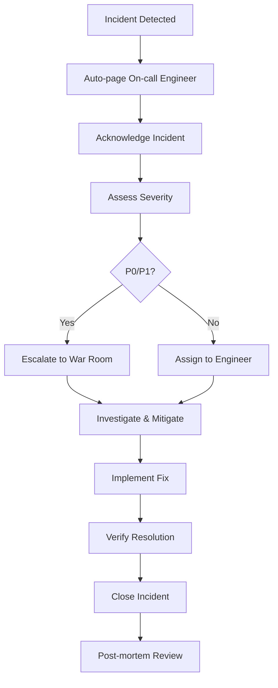

# Monitoring & Recovery Strategy: VagrantGazelle
**Comprehensive Observability & Disaster Recovery Framework**  
**SRE-focused approach with automated incident response**  
**Target: 99.9% uptime with < 2-minute MTTR**

## Table of Contents
1. [Observability Stack](#observability-stack)
2. [Monitoring Architecture](#monitoring-architecture)
3. [Alerting Strategy](#alerting-strategy)
4. [SLA/SLO/SLI Framework](#slaslosli-framework)
5. [Disaster Recovery Plan](#disaster-recovery-plan)
6. [Incident Response Procedures](#incident-response-procedures)
7. [Runbooks & Automation](#runbooks--automation)

---

## 1. Observability Stack

### Core Components Overview

```
┌─────────────────────────────────────────────────────────┐
│                  Observability Stack                    │
├─────────────────┬─────────────────┬─────────────────────┤
│     Metrics     │      Logs       │       Traces        │
│   Prometheus    │   Loki/ELK      │    Jaeger/Tempo     │
│   + Grafana     │   + Grafana     │    + Grafana        │
└─────────────────┴─────────────────┴─────────────────────┘
                          │
                          ▼
              ┌─────────────────────────┐
              │    Alerting Engine      │
              │   AlertManager +        │
              │   PagerDuty/Slack       │
              └─────────────────────────┘
```

### Technology Stack Selection

#### Metrics Collection & Storage
- **Prometheus** - Time-series metrics collection
- **Grafana** - Visualization and dashboards
- **Node Exporter** - System metrics
- **MySQL Exporter** - Database metrics
- **Nginx Exporter** - Web server metrics
- **Redis Exporter** - Cache metrics

#### Log Management
- **Loki** - Log aggregation and storage
- **Promtail** - Log collection agent
- **Grafana** - Log visualization and search

#### Distributed Tracing
- **Jaeger** - Distributed tracing system
- **OpenTelemetry** - Instrumentation library

#### Alerting & Notification
- **AlertManager** - Alert routing and grouping
- **PagerDuty** - Incident management
- **Slack** - Team notifications

---

## 2. Monitoring Architecture

### Infrastructure Deployment

#### Prometheus Configuration

```yaml
# monitoring/prometheus/prometheus.yml
global:
  scrape_interval: 15s
  evaluation_interval: 15s

rule_files:
  - "rules/*.yml"

alerting:
  alertmanagers:
    - static_configs:
        - targets:
          - alertmanager:9093

scrape_configs:
  # Application metrics
  - job_name: 'gazelle-app'
    static_configs:
      - targets: ['gazelle-app:9090']
    metrics_path: /metrics
    scrape_interval: 10s

  # System metrics
  - job_name: 'node-exporter'
    static_configs:
      - targets: 
        - 'node-exporter-1:9100'
        - 'node-exporter-2:9100'
        - 'node-exporter-3:9100'

  # Database metrics
  - job_name: 'mysql-exporter'
    static_configs:
      - targets: ['mysql-exporter:9104']

  # Cache metrics  
  - job_name: 'redis-exporter'
    static_configs:
      - targets: ['redis-exporter:9121']

  # Web server metrics
  - job_name: 'nginx-exporter'
    static_configs:
      - targets: ['nginx-exporter:9113']

  # Kubernetes metrics
  - job_name: 'kubernetes-apiservers'
    kubernetes_sd_configs:
    - role: endpoints
    scheme: https
    tls_config:
      ca_file: /var/run/secrets/kubernetes.io/serviceaccount/ca.crt
    bearer_token_file: /var/run/secrets/kubernetes.io/serviceaccount/token
```

#### Grafana Dashboards

```json
{
  "dashboard": {
    "id": null,
    "title": "Gazelle Application Overview",
    "tags": ["gazelle", "application"],
    "timezone": "browser",
    "panels": [
      {
        "id": 1,
        "title": "Request Rate",
        "type": "stat",
        "targets": [
          {
            "expr": "sum(rate(nginx_ingress_controller_requests[5m]))",
            "legendFormat": "Requests/sec"
          }
        ],
        "fieldConfig": {
          "defaults": {
            "unit": "reqps",
            "min": 0
          }
        }
      },
      {
        "id": 2,
        "title": "Response Time (95th percentile)",
        "type": "stat", 
        "targets": [
          {
            "expr": "histogram_quantile(0.95, sum(rate(nginx_ingress_controller_request_duration_seconds_bucket[5m])) by (le))",
            "legendFormat": "95th percentile"
          }
        ],
        "fieldConfig": {
          "defaults": {
            "unit": "s",
            "min": 0,
            "thresholds": {
              "steps": [
                {"color": "green", "value": null},
                {"color": "yellow", "value": 1},
                {"color": "red", "value": 2}
              ]
            }
          }
        }
      },
      {
        "id": 3,
        "title": "Error Rate",
        "type": "stat",
        "targets": [
          {
            "expr": "sum(rate(nginx_ingress_controller_requests{status=~\"5..\"}[5m])) / sum(rate(nginx_ingress_controller_requests[5m]))",
            "legendFormat": "Error Rate"
          }
        ],
        "fieldConfig": {
          "defaults": {
            "unit": "percentunit",
            "min": 0,
            "max": 1,
            "thresholds": {
              "steps": [
                {"color": "green", "value": null},
                {"color": "yellow", "value": 0.01},
                {"color": "red", "value": 0.05}
              ]
            }
          }
        }
      }
    ]
  }
}
```

#### Kubernetes Monitoring Deployment

```yaml
# monitoring/k8s/monitoring-namespace.yaml
apiVersion: v1
kind: Namespace
metadata:
  name: monitoring

---
# monitoring/k8s/prometheus-deployment.yaml
apiVersion: apps/v1
kind: Deployment
metadata:
  name: prometheus
  namespace: monitoring
spec:
  replicas: 1
  selector:
    matchLabels:
      app: prometheus
  template:
    metadata:
      labels:
        app: prometheus
    spec:
      containers:
      - name: prometheus
        image: prom/prometheus:latest
        ports:
        - containerPort: 9090
        volumeMounts:
        - name: config-volume
          mountPath: /etc/prometheus
        - name: storage-volume
          mountPath: /prometheus
        command:
          - '/bin/prometheus'
          - '--config.file=/etc/prometheus/prometheus.yml'
          - '--storage.tsdb.path=/prometheus'
          - '--web.console.libraries=/etc/prometheus/console_libraries'
          - '--web.console.templates=/etc/prometheus/consoles'
          - '--storage.tsdb.retention.time=30d'
          - '--web.enable-lifecycle'
        resources:
          requests:
            memory: "1Gi"
            cpu: "500m"
          limits:
            memory: "2Gi"
            cpu: "1000m"
      volumes:
      - name: config-volume
        configMap:
          name: prometheus-config
      - name: storage-volume
        persistentVolumeClaim:
          claimName: prometheus-pvc

---
# monitoring/k8s/grafana-deployment.yaml
apiVersion: apps/v1
kind: Deployment
metadata:
  name: grafana
  namespace: monitoring
spec:
  replicas: 1
  selector:
    matchLabels:
      app: grafana
  template:
    metadata:
      labels:
        app: grafana
    spec:
      containers:
      - name: grafana
        image: grafana/grafana:latest
        ports:
        - containerPort: 3000
        env:
        - name: GF_SECURITY_ADMIN_PASSWORD
          valueFrom:
            secretKeyRef:
              name: grafana-secret
              key: admin-password
        volumeMounts:
        - name: grafana-storage
          mountPath: /var/lib/grafana
        resources:
          requests:
            memory: "512Mi"
            cpu: "250m"
          limits:
            memory: "1Gi"
            cpu: "500m"
      volumes:
      - name: grafana-storage
        persistentVolumeClaim:
          claimName: grafana-pvc
```

---

## 3. Alerting Strategy

### Alert Rules Configuration

```yaml
# monitoring/prometheus/rules/gazelle-alerts.yml
groups:
- name: gazelle.rules
  rules:
  
  # Critical Alerts (Page immediately)
  - alert: GazelleDown
    expr: up{job="gazelle-app"} == 0
    for: 1m
    labels:
      severity: critical
      team: platform
      service: gazelle
    annotations:
      summary: "Gazelle application is down"
      description: "Gazelle application has been down for more than 1 minute"
      runbook_url: "https://runbooks.gazelle.com/alerts/application-down"

  - alert: HighErrorRate
    expr: |
      (
        sum(rate(nginx_ingress_controller_requests{status=~"5.."}[5m]))
        /
        sum(rate(nginx_ingress_controller_requests[5m]))
      ) > 0.05
    for: 5m
    labels:
      severity: critical
      team: platform
      service: gazelle
    annotations:
      summary: "High error rate detected"
      description: "Error rate is {{ $value | humanizePercentage }} for the last 5 minutes"
      runbook_url: "https://runbooks.gazelle.com/alerts/high-error-rate"

  - alert: DatabaseConnectionFailure
    expr: mysql_up == 0
    for: 2m
    labels:
      severity: critical
      team: data
      service: mysql
    annotations:
      summary: "Database connection failure"
      description: "Unable to connect to MySQL database for {{ $value }} minutes"
      runbook_url: "https://runbooks.gazelle.com/alerts/database-down"

  # Warning Alerts (Notify team)
  - alert: HighLatency
    expr: |
      histogram_quantile(0.95,
        sum(rate(nginx_ingress_controller_request_duration_seconds_bucket[5m])) by (le)
      ) > 2
    for: 10m
    labels:
      severity: warning
      team: platform
      service: gazelle
    annotations:
      summary: "High latency detected"
      description: "95th percentile latency is {{ $value }}s for the last 10 minutes"
      runbook_url: "https://runbooks.gazelle.com/alerts/high-latency"

  - alert: HighMemoryUsage
    expr: |
      (
        (node_memory_MemTotal_bytes - node_memory_MemAvailable_bytes) 
        / node_memory_MemTotal_bytes
      ) > 0.85
    for: 5m
    labels:
      severity: warning
      team: platform
      service: infrastructure
    annotations:
      summary: "High memory usage"
      description: "Memory usage is {{ $value | humanizePercentage }} on {{ $labels.instance }}"
      runbook_url: "https://runbooks.gazelle.com/alerts/high-memory-usage"

  - alert: DiskSpaceLow
    expr: |
      (
        (node_filesystem_avail_bytes{mountpoint="/"} * 100) 
        / node_filesystem_size_bytes{mountpoint="/"}
      ) < 10
    for: 5m
    labels:
      severity: warning
      team: platform
      service: infrastructure
    annotations:
      summary: "Low disk space"
      description: "Disk space is {{ $value }}% available on {{ $labels.instance }}"
      runbook_url: "https://runbooks.gazelle.com/alerts/low-disk-space"

  # Informational Alerts
  - alert: HighCPUUsage
    expr: |
      (
        100 - (avg by(instance) (irate(node_cpu_seconds_total{mode="idle"}[5m])) * 100)
      ) > 80
    for: 15m
    labels:
      severity: info
      team: platform
      service: infrastructure
    annotations:
      summary: "High CPU usage"
      description: "CPU usage is {{ $value }}% on {{ $labels.instance }}"
      runbook_url: "https://runbooks.gazelle.com/alerts/high-cpu-usage"
```

### AlertManager Configuration

```yaml
# monitoring/alertmanager/alertmanager.yml
global:
  smtp_smarthost: 'localhost:587'
  smtp_from: 'alerts@gazelle.com'
  slack_api_url: 'https://hooks.slack.com/services/YOUR/SLACK/WEBHOOK'

templates:
  - '/etc/alertmanager/templates/*.tmpl'

route:
  group_by: ['alertname', 'cluster', 'service']
  group_wait: 10s
  group_interval: 10s
  repeat_interval: 12h
  receiver: 'default'
  routes:
  
  # Critical alerts - Page immediately
  - match:
      severity: critical
    receiver: 'pagerduty-critical'
    group_wait: 0s
    group_interval: 5m
    repeat_interval: 5m
    
  # Warning alerts - Slack notification
  - match:
      severity: warning
    receiver: 'slack-warnings'
    group_wait: 30s
    group_interval: 5m
    repeat_interval: 1h
    
  # Informational alerts - Email
  - match:
      severity: info
    receiver: 'email-info'
    group_wait: 5m
    group_interval: 10m
    repeat_interval: 4h

receivers:
- name: 'default'
  slack_configs:
  - channel: '#alerts'
    title: 'Gazelle Alert'
    text: '{{ range .Alerts }}{{ .Annotations.description }}{{ end }}'

- name: 'pagerduty-critical'
  pagerduty_configs:
  - service_key: 'YOUR-PAGERDUTY-SERVICE-KEY'
    description: '{{ range .Alerts }}{{ .Annotations.summary }}{{ end }}'
    
- name: 'slack-warnings'
  slack_configs:
  - channel: '#platform-alerts'
    color: 'warning'
    title: 'Warning: {{ range .Alerts }}{{ .Annotations.summary }}{{ end }}'
    text: |
      {{ range .Alerts }}
      *Alert:* {{ .Annotations.summary }}
      *Description:* {{ .Annotations.description }}
      *Runbook:* {{ .Annotations.runbook_url }}
      {{ end }}
      
- name: 'email-info'
  email_configs:
  - to: 'platform-team@gazelle.com'
    subject: 'Gazelle Info Alert'
    body: |
      {{ range .Alerts }}
      Alert: {{ .Annotations.summary }}
      Description: {{ .Annotations.description }}
      {{ end }}

inhibit_rules:
- source_match:
    severity: 'critical'
  target_match:
    severity: 'warning'
  equal: ['alertname', 'instance']
```

---

## 4. SLA/SLO/SLI Framework

### Service Level Objectives (SLOs)

#### Availability SLO
**Target:** 99.9% uptime (8.77 hours downtime per year)

```yaml
slo_availability:
  objective: 99.9
  measurement_window: 30d
  sli: |
    sum(rate(nginx_ingress_controller_requests{status!~"5.."}[5m]))
    /
    sum(rate(nginx_ingress_controller_requests[5m]))
```

#### Latency SLO  
**Target:** 95% of requests served in < 2 seconds

```yaml
slo_latency:
  objective: 95
  measurement_window: 30d
  sli: |
    histogram_quantile(0.95,
      sum(rate(nginx_ingress_controller_request_duration_seconds_bucket[5m])) by (le)
    ) < 2
```

#### Error Rate SLO
**Target:** < 0.1% error rate

```yaml
slo_error_rate:
  objective: 99.9
  measurement_window: 30d
  sli: |
    1 - (
      sum(rate(nginx_ingress_controller_requests{status=~"5.."}[5m]))
      /
      sum(rate(nginx_ingress_controller_requests[5m]))
    )
```

### SLI Implementation

```yaml
# monitoring/prometheus/rules/sli-rules.yml
groups:
- name: sli.rules
  interval: 30s
  rules:
  
  # Availability SLI
  - record: sli:availability:ratio_rate5m
    expr: |
      sum(rate(nginx_ingress_controller_requests{status!~"5.."}[5m]))
      /
      sum(rate(nginx_ingress_controller_requests[5m]))
      
  # Latency SLI
  - record: sli:latency:ratio_rate5m
    expr: |
      (
        sum(rate(nginx_ingress_controller_request_duration_seconds_bucket{le="2"}[5m]))
        /
        sum(rate(nginx_ingress_controller_request_duration_seconds_count[5m]))
      )
      
  # Error Budget Calculation
  - record: slo:availability:error_budget_remaining
    expr: |
      1 - (
        (1 - sli:availability:ratio_rate5m)
        /
        (1 - 0.999)
      )
```

### Error Budget Alerts

```yaml
# Error budget consumption alerts
- alert: ErrorBudgetBurn
  expr: |
    slo:availability:error_budget_remaining < 0.1
  for: 5m
  labels:
    severity: critical
    team: platform
  annotations:
    summary: "Error budget critically low"
    description: "Only {{ $value | humanizePercentage }} error budget remaining"
    
- alert: ErrorBudgetBurnRate
  expr: |
    (
      1 - sli:availability:ratio_rate5m
    ) > (
      14.4 * (1 - 0.999)
    )
  for: 2m
  labels:
    severity: critical
    team: platform
  annotations:
    summary: "High error budget burn rate"
    description: "Current burn rate will exhaust error budget in < 6 hours"
```

---

## 5. Disaster Recovery Plan

### Recovery Time Objectives (RTO) & Recovery Point Objectives (RPO)

| Service Component | RTO | RPO | Strategy |
|-------------------|-----|-----|----------|
| Web Application | 5 minutes | 0 minutes | Blue-Green Deployment |
| Database | 15 minutes | 1 hour | Point-in-time recovery |
| Search Index | 30 minutes | 4 hours | Index rebuild |
| User Files/Assets | 1 hour | 24 hours | S3 backup restoration |

### Backup Strategy

#### Database Backup

```bash
#!/bin/bash
# scripts/backup-database.sh

set -e

TIMESTAMP=$(date +%Y%m%d_%H%M%S)
BACKUP_DIR="/backups/mysql"
DATABASE="gazelle"
S3_BUCKET="gazelle-backups"

# Create backup directory
mkdir -p ${BACKUP_DIR}

# Dump database with compression
mysqldump \
  --single-transaction \
  --routines \
  --triggers \
  --events \
  --lock-tables=false \
  ${DATABASE} | gzip > ${BACKUP_DIR}/gazelle_${TIMESTAMP}.sql.gz

# Upload to S3 with encryption
aws s3 cp ${BACKUP_DIR}/gazelle_${TIMESTAMP}.sql.gz \
  s3://${S3_BUCKET}/mysql/gazelle_${TIMESTAMP}.sql.gz \
  --server-side-encryption AES256 \
  --storage-class STANDARD_IA

# Cleanup local backups older than 7 days
find ${BACKUP_DIR} -name "gazelle_*.sql.gz" -mtime +7 -delete

# Verify backup integrity
gunzip -t ${BACKUP_DIR}/gazelle_${TIMESTAMP}.sql.gz

echo "Backup completed successfully: gazelle_${TIMESTAMP}.sql.gz"
```

#### Automated Backup Validation

```yaml
# k8s/backup-cronjob.yaml
apiVersion: batch/v1
kind: CronJob
metadata:
  name: database-backup
  namespace: gazelle
spec:
  schedule: "0 2 * * *" # Daily at 2 AM
  successfulJobsHistoryLimit: 3
  failedJobsHistoryLimit: 1
  jobTemplate:
    spec:
      template:
        spec:
          restartPolicy: OnFailure
          containers:
          - name: mysql-backup
            image: mysql:8.0
            command:
            - /bin/bash
            - -c
            - |
              # Backup database
              mysqldump --single-transaction \
                -h ${DB_HOST} -u ${DB_USER} -p${DB_PASSWORD} \
                ${DB_NAME} | gzip > /backup/gazelle_$(date +%Y%m%d_%H%M%S).sql.gz
                
              # Upload to S3
              aws s3 cp /backup/gazelle_*.sql.gz \
                s3://gazelle-backups/mysql/ \
                --server-side-encryption AES256
                
              # Test restore (to separate test database)
              gunzip -c /backup/gazelle_*.sql.gz | \
                mysql -h ${TEST_DB_HOST} -u ${DB_USER} -p${DB_PASSWORD} ${TEST_DB_NAME}
                
            env:
            - name: DB_HOST
              valueFrom:
                secretKeyRef:
                  name: database-secret
                  key: host
            - name: DB_USER
              valueFrom:
                secretKeyRef:
                  name: database-secret
                  key: username
            - name: DB_PASSWORD
              valueFrom:
                secretKeyRef:
                  name: database-secret
                  key: password
            - name: DB_NAME
              value: "gazelle"
            volumeMounts:
            - name: backup-storage
              mountPath: /backup
          volumes:
          - name: backup-storage
            emptyDir: {}
```

### Multi-Region Failover

#### AWS Route 53 Health Checks

```yaml
# terraform/route53-healthcheck.tf
resource "aws_route53_health_check" "primary" {
  fqdn                            = "gazelle.yourdomain.com"
  port                            = 443
  type                            = "HTTPS"
  resource_path                   = "/health"
  failure_threshold               = "3"
  request_interval                = "30"
  cloudwatch_alarm_region         = "us-west-2"
  cloudwatch_alarm_name           = "gazelle-health-check-failed"
  insufficient_data_health_status = "Failure"

  tags = {
    Name = "gazelle-primary-health-check"
  }
}

resource "aws_route53_record" "primary" {
  zone_id = aws_route53_zone.main.zone_id
  name    = "gazelle.yourdomain.com"
  type    = "A"
  
  set_identifier = "primary"
  
  failover_routing_policy {
    type = "PRIMARY"
  }
  
  health_check_id = aws_route53_health_check.primary.id
  
  alias {
    name                   = aws_lb.primary.dns_name
    zone_id                = aws_lb.primary.zone_id
    evaluate_target_health = true
  }
}

resource "aws_route53_record" "secondary" {
  zone_id = aws_route53_zone.main.zone_id
  name    = "gazelle.yourdomain.com"
  type    = "A"
  
  set_identifier = "secondary"
  
  failover_routing_policy {
    type = "SECONDARY"
  }
  
  alias {
    name                   = aws_lb.secondary.dns_name
    zone_id                = aws_lb.secondary.zone_id
    evaluate_target_health = true
  }
}
```

---

## 6. Incident Response Procedures

### Incident Classification

#### Severity Levels
| Level | Description | Response Time | Example |
|-------|-------------|---------------|---------|
| P0 | Critical - Service completely down | 5 minutes | Database offline, application unreachable |
| P1 | High - Major feature impaired | 15 minutes | High error rate, search not working |
| P2 | Medium - Minor feature impaired | 1 hour | Slow response times, minor UI issues |
| P3 | Low - Cosmetic or enhancement | 24 hours | UI inconsistencies, non-critical features |

### Incident Response Workflow



### Automated Response Actions

```yaml
# monitoring/alertmanager/auto-remediation.yml
# Example webhook for auto-remediation
receivers:
- name: 'auto-remediation'
  webhook_configs:
  - url: 'http://automation-service:8080/webhooks/alerts'
    http_config:
      bearer_token: 'your-auth-token'
    send_resolved: true
```

```python
# automation-service/handlers/alert_handler.py
from flask import Flask, request
import kubernetes
import subprocess

app = Flask(__name__)

@app.route('/webhooks/alerts', methods=['POST'])
def handle_alert():
    alert_data = request.json
    
    for alert in alert_data.get('alerts', []):
        alert_name = alert.get('labels', {}).get('alertname')
        
        # Auto-restart pods for application down alert
        if alert_name == 'GazelleDown' and alert.get('status') == 'firing':
            restart_application_pods()
            
        # Auto-scale for high CPU alert
        elif alert_name == 'HighCPUUsage' and alert.get('status') == 'firing':
            scale_application(replicas=5)
            
        # Clear cache for high memory alert
        elif alert_name == 'HighMemoryUsage' and alert.get('status') == 'firing':
            clear_redis_cache()
            
    return 'OK', 200

def restart_application_pods():
    """Restart application pods"""
    try:
        kubernetes.config.load_incluster_config()
        v1 = kubernetes.client.AppsV1Api()
        
        # Rolling restart by updating annotation
        body = {
            'spec': {
                'template': {
                    'metadata': {
                        'annotations': {
                            'kubectl.kubernetes.io/restartedAt': datetime.now().isoformat()
                        }
                    }
                }
            }
        }
        
        v1.patch_namespaced_deployment(
            name="gazelle-app",
            namespace="gazelle",
            body=body
        )
        
        print("Initiated rolling restart of gazelle-app pods")
    except Exception as e:
        print(f"Failed to restart pods: {e}")

def scale_application(replicas=5):
    """Scale application deployment"""
    try:
        kubernetes.config.load_incluster_config()
        v1 = kubernetes.client.AppsV1Api()
        
        # Scale deployment
        body = {'spec': {'replicas': replicas}}
        v1.patch_namespaced_deployment_scale(
            name="gazelle-app",
            namespace="gazelle", 
            body=body
        )
        
        print(f"Scaled gazelle-app to {replicas} replicas")
    except Exception as e:
        print(f"Failed to scale application: {e}")

def clear_redis_cache():
    """Clear Redis cache"""
    try:
        subprocess.run([
            'kubectl', 'exec', '-n', 'gazelle',
            'deployment/redis', '--', 'redis-cli', 'FLUSHDB'
        ], check=True)
        
        print("Cleared Redis cache")
    except Exception as e:
        print(f"Failed to clear cache: {e}")
```

---

## 7. Runbooks & Automation

### Common Incident Runbooks

#### Database Connection Issues

```markdown
# Runbook: Database Connection Failure

## Symptoms
- Application showing 500 errors
- Database connection timeouts
- mysql_up metric showing 0

## Investigation Steps
1. Check database server status
   ```bash
   kubectl get pods -n gazelle | grep mysql
   kubectl logs -n gazelle deployment/mysql
   ```

2. Check network connectivity
   ```bash
   kubectl exec -it deployment/gazelle-app -n gazelle -- nc -zv mysql-service 3306
   ```

3. Check database logs
   ```bash
   kubectl logs -n gazelle deployment/mysql --tail=100
   ```

4. Check connection pool status
   ```bash
   kubectl exec -it deployment/gazelle-app -n gazelle -- php -r "
   $pdo = new PDO('mysql:host=mysql-service;port=3306', 'user', 'pass');
   echo 'Connection successful';
   "
   ```

## Resolution Steps
1. If database pod is down:
   ```bash
   kubectl rollout restart deployment/mysql -n gazelle
   ```

2. If connection pool exhausted:
   ```bash
   kubectl rollout restart deployment/gazelle-app -n gazelle
   ```

3. If disk full:
   ```bash
   # Increase PVC size
   kubectl patch pvc mysql-pvc -n gazelle -p '{"spec":{"resources":{"requests":{"storage":"200Gi"}}}}'
   ```

## Prevention
- Monitor disk usage alerts
- Set up connection pool monitoring
- Regular database maintenance
```

#### High Memory Usage

```markdown
# Runbook: High Memory Usage Alert

## Symptoms  
- Memory usage > 85%
- Potential OOM kills
- Application slowness

## Investigation Steps
1. Identify memory consumers
   ```bash
   kubectl top pods -n gazelle
   kubectl describe pod <pod-name> -n gazelle
   ```

2. Check for memory leaks
   ```bash
   kubectl exec -it <pod-name> -n gazelle -- ps aux --sort=-%mem
   ```

3. Review application metrics
   ```bash
   # Check Grafana dashboard for memory usage patterns
   ```

## Resolution Steps
1. Immediate relief:
   ```bash
   # Restart high-memory pods
   kubectl delete pod <pod-name> -n gazelle
   
   # Clear caches
   kubectl exec -it deployment/redis -n gazelle -- redis-cli FLUSHDB
   ```

2. Scale out if needed:
   ```bash
   kubectl scale deployment gazelle-app --replicas=5 -n gazelle
   ```

3. Adjust resource limits:
   ```bash
   kubectl patch deployment gazelle-app -n gazelle -p '
   {
     "spec": {
       "template": {
         "spec": {
           "containers": [
             {
               "name": "gazelle-app",
               "resources": {
                 "limits": {"memory": "1Gi"},
                 "requests": {"memory": "512Mi"}
               }
             }
           ]
         }
       }
     }
   }'
   ```

## Prevention
- Implement memory profiling
- Regular performance reviews
- Set appropriate resource limits
```

### Automation Scripts

#### Health Check Automation

```bash
#!/bin/bash
# scripts/health-check.sh

set -e

NAMESPACE="gazelle"
TIMEOUT=30

echo "Running comprehensive health check..."

# Check pod status
echo "Checking pod status..."
kubectl get pods -n ${NAMESPACE} --field-selector=status.phase!=Running --no-headers | wc -l | \
  xargs -I {} test {} -eq 0 || {
    echo "ERROR: Non-running pods detected"
    kubectl get pods -n ${NAMESPACE}
    exit 1
  }

# Check service endpoints
echo "Checking service endpoints..."
for service in gazelle-service mysql-service redis-service; do
  endpoints=$(kubectl get endpoints ${service} -n ${NAMESPACE} -o jsonpath='{.subsets[*].addresses[*].ip}' | wc -w)
  if [ ${endpoints} -eq 0 ]; then
    echo "ERROR: No endpoints for ${service}"
    exit 1
  fi
  echo "✓ ${service}: ${endpoints} endpoints"
done

# Check application health endpoint
echo "Checking application health..."
kubectl run health-check --rm -i --restart=Never --image=curlimages/curl -- \
  curl -f --max-time ${TIMEOUT} http://gazelle-service.${NAMESPACE}.svc.cluster.local/health || {
    echo "ERROR: Application health check failed"
    exit 1
  }

# Check database connectivity
echo "Checking database connectivity..."
kubectl run db-check --rm -i --restart=Never --image=mysql:8.0 -- \
  mysql -h mysql-service.${NAMESPACE}.svc.cluster.local -u root -p${DB_PASSWORD} -e "SELECT 1" || {
    echo "ERROR: Database connectivity check failed"
    exit 1
  }

# Check Redis connectivity
echo "Checking Redis connectivity..."
kubectl run redis-check --rm -i --restart=Never --image=redis:7-alpine -- \
  redis-cli -h redis-service.${NAMESPACE}.svc.cluster.local ping | grep -q PONG || {
    echo "ERROR: Redis connectivity check failed"
    exit 1
  }

echo "All health checks passed! ✅"
```

#### Automated Recovery Script

```bash
#!/bin/bash
# scripts/auto-recovery.sh

set -e

NAMESPACE="gazelle"
LOG_FILE="/var/log/auto-recovery.log"

log() {
  echo "$(date '+%Y-%m-%d %H:%M:%S') - $1" | tee -a ${LOG_FILE}
}

# Function to check if pods are in crash loop
check_crash_loops() {
  local crash_pods=$(kubectl get pods -n ${NAMESPACE} -o jsonpath='{range .items[*]}{.metadata.name}{" "}{.status.containerStatuses[0].restartCount}{"\n"}{end}' | awk '$2 > 5 {print $1}')
  
  if [ -n "${crash_pods}" ]; then
    log "CRITICAL: Crash looping pods detected: ${crash_pods}"
    
    # Attempt recovery by rolling restart
    for pod in ${crash_pods}; do
      local deployment=$(kubectl get pod ${pod} -n ${NAMESPACE} -o jsonpath='{.metadata.labels.app}')
      if [ -n "${deployment}" ]; then
        log "Attempting rolling restart of deployment: ${deployment}"
        kubectl rollout restart deployment/${deployment} -n ${NAMESPACE}
        kubectl rollout status deployment/${deployment} -n ${NAMESPACE} --timeout=300s
      fi
    done
  fi
}

# Function to check resource usage and scale if needed
auto_scale_check() {
  local cpu_usage=$(kubectl top pods -n ${NAMESPACE} --no-headers | awk '{sum+=$3} END {print sum}' | sed 's/m//')
  local current_replicas=$(kubectl get deployment gazelle-app -n ${NAMESPACE} -o jsonpath='{.spec.replicas}')
  
  # Scale up if average CPU > 70% and replicas < 10
  if [ ${cpu_usage} -gt 700 ] && [ ${current_replicas} -lt 10 ]; then
    local new_replicas=$((current_replicas + 2))
    log "High CPU usage detected (${cpu_usage}m), scaling to ${new_replicas} replicas"
    kubectl scale deployment gazelle-app --replicas=${new_replicas} -n ${NAMESPACE}
  fi
  
  # Scale down if average CPU < 30% and replicas > 3
  if [ ${cpu_usage} -lt 300 ] && [ ${current_replicas} -gt 3 ]; then
    local new_replicas=$((current_replicas - 1))
    log "Low CPU usage detected (${cpu_usage}m), scaling to ${new_replicas} replicas"
    kubectl scale deployment gazelle-app --replicas=${new_replicas} -n ${NAMESPACE}
  fi
}

# Function to clear caches if memory usage is high
cache_management() {
  local memory_usage=$(kubectl top nodes --no-headers | awk '{print $5}' | sed 's/%//' | sort -rn | head -1)
  
  if [ ${memory_usage} -gt 85 ]; then
    log "High memory usage detected (${memory_usage}%), clearing caches"
    kubectl exec -n ${NAMESPACE} deployment/redis -- redis-cli FLUSHDB
    
    # Restart PHP-FPM to clear opcache
    kubectl exec -n ${NAMESPACE} deployment/gazelle-app -- killall -USR2 php-fpm
  fi
}

# Main execution
log "Starting automated recovery checks"

check_crash_loops
auto_scale_check
cache_management

log "Automated recovery checks completed"
```

This comprehensive monitoring and recovery strategy provides automated incident response, detailed observability, and robust disaster recovery capabilities for the VagrantGazelle application, ensuring high availability and rapid recovery from failures.